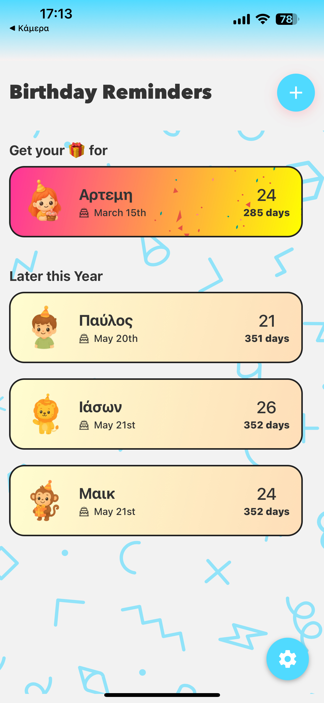
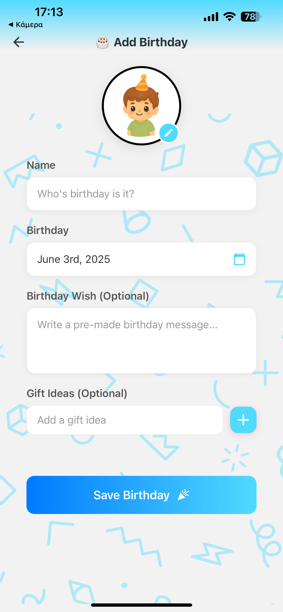
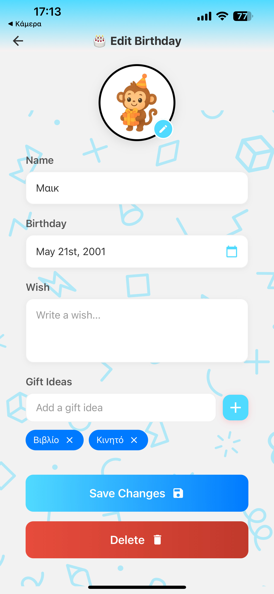
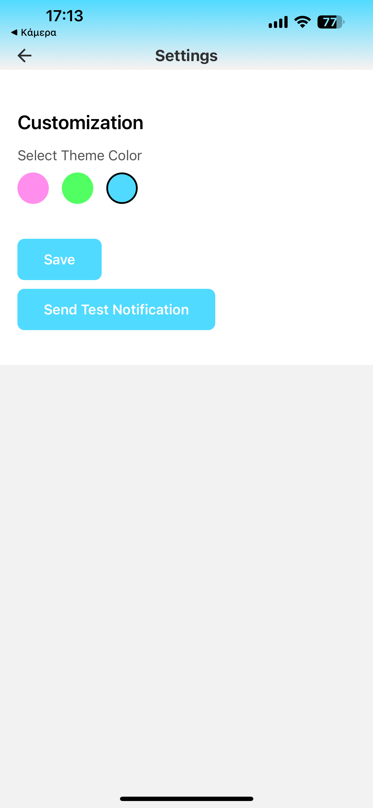

# CakeTime: Never Forget a Birthday 🎂  

CakeTime is a mobile app that helps you remember, track, and plan birthdays for your favorite people.  
No more last-minute scrambles for gifts or forgetting to send a wish — CakeTime keeps you ready to celebrate.  

---

## 📱 App Preview  

| Dashboard | Add Birthday | Edit Details | Settings |
|-----------|--------------|--------------|----------|
|  |  |  |  |

---

## ✨ Key Features  

### Stay on Top of Birthdays  
- **Countdown Dashboard:** See how many days are left for each friend.  
- **Next Up Highlight:** The nearest birthday is always front and center.  
- **Smart Notifications:** Set reminders in advance — even test them in settings.  

### Manage Friends Easily  
- Add profiles with **name, date picker, and custom avatar**.  
- Save **personalized birthday wishes** directly in the app.  
- Edit or delete entries with just one tap.  

### Plan Better Gifts  
- Capture ideas in a **Gift Ideas field** throughout the year.  
- Items are converted into **tags** for a clean, organized shopping list.  

### Make It Yours  
- Personalize the app with a **theme color** (Pink, Green, or Cyan).  

---

## 🛠️ Tech Stack  

- **Frontend:** React Native  
- **Notifications:** Native Local Notifications  
- **Database:** Firestore  

---

## 🚀 Getting Started  

Clone and run the app locally:  

```bash
# Clone the repository
git clone https://github.com/IasonTsivos/CakeTime.git

# Navigate to the project folder
cd CakeTime

# Install dependencies
npm install

# Run on Android or iOS
npx react-native run-android
# or
npx react-native run-ios
